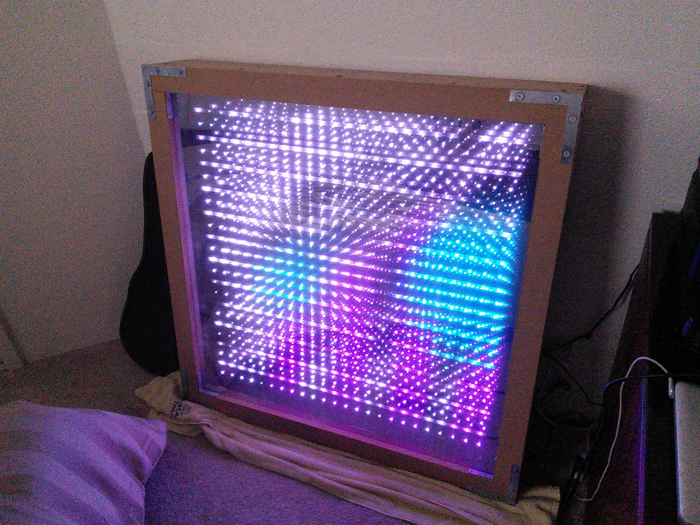
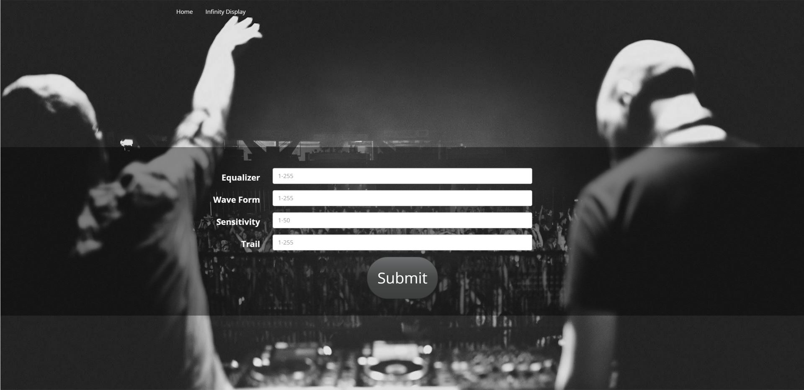

# The Infinity Display

## Overview

This is a web application that collects parameter values for a LED display.

The current version will ask a user for four values:

  * Equalizer opacity
  * Wave form opacity
  * Sound reactive sensitivity
  * Trail effect intensity

These values are then packaged into a text file that is then read by the device driving the LEDs.

To use this, the user must have both IntelliJ and Processing installed.

A physical LED display is not required to develop code for this project.

Animations can be simulated using a Processing GUI.

## Features

The Infinity Display provides the following features:

  * Visual and interactive stimulation
  * Communication between two programs
  * Remote access
  * Blindness

## Version information

Play 2.3.7, Bootstrap 3.3.2

## Wiki Pages

[User Guide](https://github.com/noelmkawano/InfinityDisplay/wiki/User-Guide)
[Developer Guide](https://github.com/noelmkawano/InfinityDisplay/wiki/Developer-Guide)
[Contact Us](https://github.com/noelmkawano/InfinityDisplay/wiki/Contact-Us)